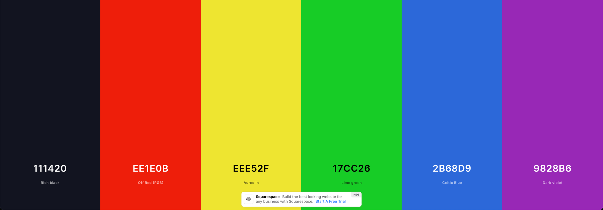

# Chess 'i Guess

### made with:
- ✅flask  https://flask.palletsprojects.com
- ❌tailwind  https://tailwindui.com/
- ❌material-ui (tailwind)  https://www.material-tailwind.com
- ✅spectre.css https://picturepan2.github.io/spectre/

### Design
minimal and sleek

run with `. venv/bin/activate && python app.py`

## Theming

colors, Picks the black, a random colourful one and uses plain white
`#111420, #ee1e0b, #eee52f, #17cc26, #2b68d9, #9828b6`

`{"Rich black":"111420","Off Red":"ee1e0b","Aureolin":"eee52f","Lime green":"17cc26","Celtic Blue":"2b68d9","Dark violet":"9828b6"}`